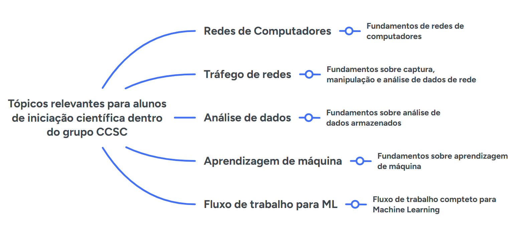

# Guia para alunos de iniciação científica do grupo CCSC

O material de referência contido neste repositório tem como objetivo auxiliar os alunos de iniciação científica (e demais interessados) nos primeiros passos considerando uma lista de tópicos relevantes dentro do grupo CCSC.
Os tópicos sugeridos suportam as principais linhas de pesquisa desenvolvidas dentro do grupo e servem tanto como uma base para as tarefas a serem desenvolvidas como uma sequência lógica de aprendizado.

**O desenvolvimento do aluno vai depender do nível de conhecimento atual e das atividades em que o mesmo irá se envolver.**

Para todos os alunos que ainda não estão familiarizados com as redes de computadores, sugerimos iniciar pelo [Módulo de Fundamentos de Redes](https://github.com/fernandonakayama/guia_iniciacao_cientifica/tree/main/redes).

Após a conclusão da parte de introdução às redes de computadores, sugerimos um aprofundamento para o [Módulo de Tráfego de Rede](https://github.com/fernandonakayama/guia_iniciacao_cientifica/tree/main/trafego_rede)s.

Para todos os alunos que forem lidar com conjuntos de dados, a sugestão é seguir para o [Módulo de Análise de Dados.](https://github.com/fernandonakayama/guia_iniciacao_cientifica/tree/main/analise_dados)

Para os alunos que forem trabalhar com modelos de aprendizagem de máquina, sugerimos o [Módulo de Aprendizagem de Máquina.](https://github.com/fernandonakayama/guia_iniciacao_cientifica/tree/main/aprendizagem_maquina)

Finalmente o Módulo [Machine Learning Pipeline](https://github.com/fernandonakayama/guia_iniciacao_cientifica/tree/main/Machine-learning-Pipeline) oferece um passo a passo em Notebooks do fluxo de trabalho para Machine Learning.

O intuito deste repositório não é oferecer todos os conceitos, técnicas e ferramentas para cada tópico. O objetivo é oferecer uma visão geral de maneira a auxiliar o aluno com suas pesquisas e o cumprimento do plano de trabalho estabelecido previamente.
